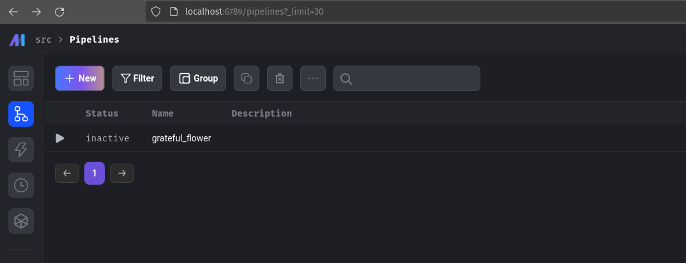
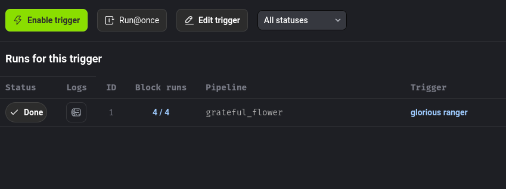
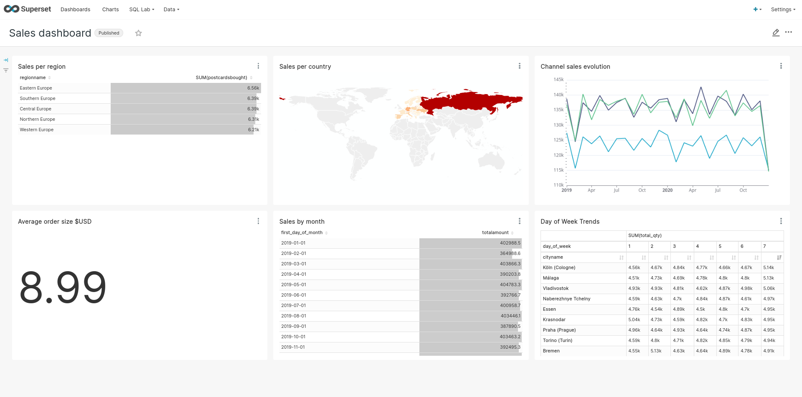

# Portable Data Stack with Mage

This application is a containerized Analytics suite for an imaginary company selling postcards. The company sells both directly but also through resellers in the majority of European countries.

## Stack

- Mage
- Docker (docker compose)
- DuckDB
- dbt core
- Superset

## For other orchestration options, check the below:
- [portable-data-stack-dagster](https://github.com/cnstlungu/portable-data-stack-dagster)
- [portable-data-stack-airflow](https://github.com/cnstlungu/portable-data-stack-airflow)

### System requirements
* [Docker](https://docs.docker.com/engine/install/)

## Setup

1. Rename `.env.example` file to `.env` and set your desired password. Remember to never commit files containing passwords or any other sensitive information.

2. Rename `shared/db/datamart.duckdb.example` to `shared/db/datamart.duckdb` or init an empty database file there with that name.

3. With **Docker engine** installed, change directory to the root folder of the project (also the one that contains docker-compose.yml) and run

    `docker compose up --build`

4. Once the Docker suite has finished loading, open up [Mage](http://localhost:6789/pipelines?_limit=30) , click on the pipeline `grateful flower` and create a `Run@once` trigger.

5. When the actions have completed, you can open the [Superset interface](http://localhost:8088)

### Demo Credentials

Demo credentials are set in the .env file mentioned above. 

### Ports exposed locally
* Mage: 6789
* Superset: 8088

Generated Parquet are saved in the **shared/parquet** folder.

The data is fictional and automatically generated. Any similarities with existing persons, entities, products or businesses are purely coincidental.

### General flow

1. Generate test data - Parquet files - using Python (generator)
2. Import data from parquet files to staging area in the Data Warehouse (DuckDB), orchestrated by Mage
3. Model data, build fact and dimension tables, load the Data Warehouse using dbt
    - installs dbt dependencies
    - seeds the database with static data (e.g. geography)
    - runs the model
    - tests the model
4. Analyze and visually explore the data using Superset or directly query the Data Warehouse database instance

For superset, the default credentials are set in the .env file: user = admin, password = admin

## Overview of architecture

The docker process will begin building the application suite. The suite is made up of the following components, each within its own docker container:
* **generator**: this is a collection of Python scripts that will generate, insert and export the example data
* **mage**: this is the orchestrator tool that will trigger the ETL tasks; its GUI is locally available on port 6789; 
* **superset**: this contains the web-based Business Intelligence application we will use to explore the data; exposed on port 8088.

Once the docker building process has completed, we may open the Mage GUI (locally: localhost:6789) to view the orchestration of our tasks.

After the DAGs have completed you can either analyze the data using the querying and visualization tools provided by Superset (available locally on port 8088), or query the Data Warehouse (available as a DuckDB Database)

## Credits

Inspired by:
- [Mage documentation](https://docs.mage.ai/getting-started/setup)